# 01 — Entry Gates Overview (G1–G8 Pipeline)

Every candidate ticker goes through the same funnel each trading day: it is
routed to one of four **universes** based on its `Sector` label, it is
checked against a set of **veto** conditions that can short-circuit
everything else, and if it survives the veto it is scored on up to eight
weighted gates (G1–G8, universe-specific logic per gate — see
[02_entry_gate_detail_per_universe.md](02_entry_gate_detail_per_universe.md)).
The gate scores are summed into a weighted score and compared against a
per-universe pass threshold that is itself adjusted by the current market
regime. A stock only becomes a BUY candidate if it clears the threshold
*and* survives several tech-specific late-stage blocks *and* meets a
minimum-direct-gates floor. Source: `engine/tester.py` (`run_gates`,
`check_veto`, `build_record`, `score_gates`, `pass_threshold`).

Note: routing is driven by the internal `Sector` bucket label assigned to
each ticker (`SECTOR_MAP` in `tester.py`, fed from the hand-curated ticker
lists in `portfolio_simulator.py SECTORS`) — **not** directly by SHARADAR's
raw industry taxonomy. The raw SHARADAR industry (`SharadarIndustry` field)
is a separate axis used only inside the G2 gm_relative percentile lookup
(diagram 03), so a ticker's universe/sub-sector and its SHARADAR industry
string are two different classifications that happen to correlate.

```mermaid
flowchart TD
    START([New candidate row: ticker, Sector, fundamentals, momentum]) --> ROUTE{Sector label ->\nSECTOR_MAP lookup}

    ROUTE -->|"Solar Hardware, CleanTech/Emerging"| ENERGY_HW["energy / solar_hw"]
    ROUTE -->|"Solar Installation"| ENERGY_INST["energy / solar_install"]
    ROUTE -->|"Renewable Utilities"| ENERGY_REN["energy / renewables"]
    ROUTE -->|"Cybersecurity"| TECH_CYBER["tech / cyber"]
    ROUTE -->|"Enterprise SaaS & AI, Data & Infrastructure,\nCommunications & Ops"| TECH_INFRA["tech / infra_saas"]
    ROUTE -->|"FinTech & Payments"| TECH_FIN["tech / fintech"]
    ROUTE -->|"Medical Devices (Heavy)"| MED_SURG["medtech / surgical"]
    ROUTE -->|"Monitoring & Specialized,\nEmerging & Biotech Med"| MED_MON["medtech / monitoring"]
    ROUTE -->|"Diagnostics & Lab Tech"| MED_IMP["medtech / implants"]
    ROUTE -->|"Major Processors"| SEMI_PROC["semi / proc_ai"]
    ROUTE -->|"Connectivity"| SEMI_CONN["semi / connectivity"]
    ROUTE -->|"Foundries, Analog & Power"| SEMI_FOUND["semi / foundry_analog"]
    ROUTE -->|"Memory & Storage,\nEmerging/Small Cap"| SEMI_MEM["semi / memory_smallcap"]
    ROUTE -->|"Sector not in SECTOR_MAP"| UNMAPPED([Return None — dropped from universe])

    ENERGY_HW & ENERGY_INST & ENERGY_REN --> UNIV_ENERGY[["Universe: ENERGY"]]
    TECH_CYBER & TECH_INFRA & TECH_FIN --> UNIV_TECH[["Universe: TECH"]]
    MED_SURG & MED_MON & MED_IMP --> UNIV_MED[["Universe: MEDTECH"]]
    SEMI_PROC & SEMI_CONN & SEMI_FOUND & SEMI_MEM --> UNIV_SEMI[["Universe: SEMI"]]

    UNIV_ENERGY & UNIV_TECH & UNIV_MED & UNIV_SEMI --> VETO0{"check_veto():\nGM Erosion > 20% (cyclical)\nor > 12% (non-cyclical)?"}
    VETO0 -->|Yes| VETOFAIL(["VETO-FAIL\nmoat-collapse kill switch\nconfidence=VETO, no scoring"])
    VETO0 -->|No| VETO1{"Sector-specific veto?\nCyber: G2<0.65 or R40<22 (no MA200 escape)\nSolar HW: G2<0.20 or R40<0 (no MA200 escape)\nFinTech: G2<0.7 or ShareGrowth>35%"}
    VETO1 -->|Yes| VETOFAIL
    VETO1 -->|No| VETO2{"momentum_decay_check():\nCyber / FinTech / Data&Infra only —\nPrice/SMA20 < 1.03?"}
    VETO2 -->|Yes| VETOFAIL
    VETO2 -->|No| VETO3{"BEAR_BANNED_SECTORS:\nsector banned in current\nregime (BEAR_VOLATILE / BEAR_GRIND)?"}
    VETO3 -->|Yes| VETOFAIL
    VETO3 -->|No| GATES["run_gates(): score G1..G8\nfor this universe/sub (see diagram 02)"]

    GATES --> SUM["score_gates():\nweighted = sum(score_override or weight if passed)\nn_direct, n_proxy counted"]
    SUM --> RESCUE["compute_momentum_rescue():\nnon-tech only — if G8 partially passed and\nscore is within rescue_range of threshold,\nadd bonus 0.3–0.8"]
    RESCUE --> PENALTY{">=2 non-G8 gates\nfully failed (score=0)?"}
    PENALTY -->|Yes| PEN["score -= 0.3"]
    PENALTY -->|No| MINDIRECT
    PEN --> MINDIRECT{"n_direct >= min_direct_gates?\ntech=3, medtech=2, energy/semi=2"}
    MINDIRECT -->|No| FAIL_MD(["FAIL: direct_gate_ok=False"])
    MINDIRECT -->|Yes| TECHBLOCKS

    subgraph TECHBLOCKS["tech-only late-stage blocks (skipped for other universes)"]
        direction TB
        TQ{"tech_quality_kill():\n>=2 of G3/G4/G5 failed?\nor G3 failed + rev<0% + fcf<-5%"}
        TQ -->|Yes| TBFAIL(["FAIL: QUALITY KILL"])
        TQ -->|No| TVQ{"tech_val_or_quality_check():\nG1=N/A and G3 failed?\nor both G1 and G3 failed?"}
        TVQ -->|Yes| TBFAIL2(["FAIL: VAL-OR-QUALITY BLOCK"])
        TVQ -->|No| TEXP{"tech_expensive_check():\nPS/Growth > 5.0 and\nscore < threshold+0.5?"}
        TEXP -->|Yes| TBFAIL3(["FAIL: EXPENSIVE BLOCK"])
        TEXP -->|No| TARM{"tech_strong_arm_check():\nG3 failed, pricing!=Strong,\nfcf<=5%, roic<=8%,\nG1 not a clean pass?"}
        TARM -->|Yes| TBFAIL4(["FAIL: STRONG-ARM BLOCK"])
        TARM -->|No| TMA{"tech_ma200_check():\nPrice_vs_MA200 <= 0?"}
        TMA -->|Yes| TBFAIL5(["FAIL: TECH MA200 BLOCK"])
        TMA -->|No| TREV{"Revenue_Growth_% < -5%\n(TECH_REV_FLOOR)?"}
        TREV -->|Yes| TBFAIL6(["FAIL: TECH REV FLOOR"])
        TREV -->|No| TECHOK(["tech blocks cleared"])
    end

    MINDIRECT -->|"universe != tech"| THRESH
    TECHOK --> THRESH{"weighted_score >= pass_threshold(universe)?"}
    TBFAIL & TBFAIL2 & TBFAIL3 & TBFAIL4 & TBFAIL5 & TBFAIL6 --> FAIL_TECH(["FAIL: strategy_passed=False"])

    THRESHNOTE["pass_threshold(universe) =\nbase + REGIME_ADJUSTMENTS[regime]\n(semi is COUNTER_CYCLICAL: no regime adjustment)\nbase: semi=5.0 tech=6.3 medtech=5.7 energy=5.5\nregime adj: BULL_STRONG=-0.5 BULL_WEAK=-0.2\nBEAR_GRIND=+0.3 BEAR_VOLATILE=+0.6"]
    THRESHNOTE -.-> THRESH

    THRESH -->|No| FAIL_SCORE(["FAIL: score below threshold"])
    THRESH -->|Yes| POSTCHECKS{"universe-specific post-pass vetoes:\nenergy: G8=0 in BULL_WEAK -> VETO\nmedtech: G8=0 in BULL_WEAK -> VETO\nsemi: Rev<-30% and R40<0 -> VETO"}
    POSTCHECKS -->|Triggered| VETOFAIL
    POSTCHECKS -->|Clear| PASS(["strategy_passed = True\nconfidence = compute_confidence()\n(HIGH/MED/LOW — diagram 05)"])

    PASS --> DONE([Candidate ranked by score,\nfed into position sizing])
```

