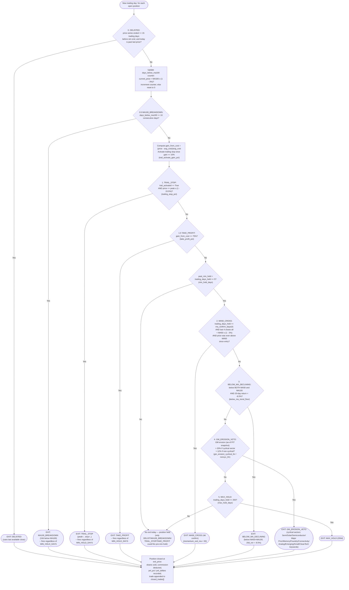

# 04 — Exit Strategy (Daily Checks Per Open Position)

`check_exits()` in `engine/portfolio_simulator.py` runs once per trading
day for every open position and evaluates conditions **in a strict
priority cascade** — as soon as one condition sets `exit_reason`, every
later `if exit_reason is None:` check is skipped for that position that
day. Two conditions (`DELISTED`, `MA100_BREAKDOWN`) and the profit-taking
pair (`TRAIL_STOP`, `TAKE_PROFIT`) can fire from day 1; all the rest
(`MA50_CROSS`, `BELOW_MA_DECLINING`, `GM_EROSION_VETO`, `MAX_HOLD`) are
gated behind `trading_days_held >= MIN_HOLD_DAYS`. All threshold values
below are the current live values loaded from
`config/strategy_params.json` at simulator startup.

Note: `engine/virtual_trader.py` is a **separate, older paper-trading
script** with its own independently hardcoded exit rules (tiered trailing
stop, fixed stop-loss per confidence tier, time stop, drawdown-duration
stop). It does not read `strategy_params.json` and is not driven by the
optimizer loop (`trade_optimizer.py` only ever invokes
`portfolio_simulator.py`) — it is not part of the exit cascade documented
here.

## Priority order summary (first match wins, evaluated in this exact order)

1. `DELISTED` — no min-hold gate
2. `MA100_BREAKDOWN` (10 consecutive days beyond -3% of MA100) — no min-hold gate
3. `TRAIL_STOP` (peak x -15.5%, only once trail activated at +10% gain) — no min-hold gate
4. `TAKE_PROFIT` (+75% gain from avg cost) — no min-hold gate
5. *(gate: `trading_days_held >= MIN_HOLD_DAYS(5)`)*
6. `MA50_CROSS` (4-day confirm below MA50, only if price was ever above MA50 since entry)
7. `BELOW_MA_DECLINING` (below MA50 and MA100, 20d return < -8.5%)
8. `GM_EROSION_VETO` (cyclical > 20%, non-cyclical > 12%)
9. `MAX_HOLD` (250 trading days)
