# 05 — Position Sizing (Signal → Dollar Amount)

Once a candidate clears the entry gates (diagrams 01–02) and is ranked by
score, `run_simulation()`'s buy loop in `engine/portfolio_simulator.py`
converts that signal into an actual dollar purchase. Sizing is shaped by
three multiplicative "brakes" applied in sequence — conviction, regime
position multiplier, and a regime exposure cap — plus a per-position
equity cap and a cash/headroom clip. If the ticker is already held,
pyramiding rules decide whether an add-on is even allowed before sizing
runs. All values shown are the current live values from
`config/strategy_params.json`.

Note on evaluation order: `regime_position_mult` and `regime_exposure_cap`
are both resolved **once per day** (from the day's regime, before the buy
loop starts), not per candidate. The exposure-cap break is the **first**
check inside the while-loop on every pass — it runs before a candidate is
even picked off the ranked list, ahead of the pyramiding and conviction
logic.

```mermaid
flowchart TD
    DAYSTART(["Once per day, before the buy loop:\nregime_pos_mult = regime_position_mult[regime]\nexposure_cap = regime_exposure_cap[regime]"]) --> LOOP(["Buy loop (per candidate), while:\ncash > $2,500 AND positions < regime_max_positions\nAND candidates remain"])

    LOOP --> EXPCHECK{"Brake 3 — current_exposure\n(MTM / total_equity) >= exposure_cap?\n(checked FIRST, before picking a candidate)"}
    EXPCHECK -->|Yes| STOPLOOP(["Stop buying for today —\nbreak out of candidate loop entirely"])
    EXPCHECK -->|No| PICK["Pick next candidate off the ranked list"]

    PICK --> HELD{"Ticker already\nin positions?"}
    HELD -->|No| NEWPOS["New position path"]
    HELD -->|Yes| PYR{"allow_pyramiding == true?"}
    PYR -->|No| SKIP1(["Skip candidate — no adds allowed"])
    PYR -->|Yes| PYRREGIME{"Regime == BEAR_VOLATILE?"}
    PYRREGIME -->|Yes| SKIP2(["Skip — no adds in confirmed bear-volatile"])
    PYRREGIME -->|No| PYRGRIND{"Regime == BEAR_GRIND\nAND pos.adds >= 1?"}
    PYRGRIND -->|Yes| SKIP3(["Skip — max 1 add allowed in bear-grind"])
    PYRGRIND -->|No| PYRMAX{"pos.adds >=\nmax_adds_per_position (2)?"}
    PYRMAX -->|Yes| SKIP4(["Skip — add-on limit reached"])
    PYRMAX -->|No| PYRGAIN{"Unrealized gain >=\nadd_on_min_gain_pct (10%)?"}
    PYRGAIN -->|No| SKIP5(["Skip — position hasn't earned an add yet"])
    PYRGAIN -->|Yes| ADDOK["Add-on approved"]

    NEWPOS & ADDOK --> CONVICTION{"confidence tier\n(from compute_confidence — diagram 01)"}
    CONVICTION -->|HIGH| CM_H["conviction_mult = 1.5"]
    CONVICTION -->|MED| CM_M["conviction_mult = 1.0"]
    CONVICTION -->|LOW| CM_L["conviction_mult = 0.4"]

    CM_H & CM_M & CM_L --> BASESIZE["buy_dollars = cash x per_buy_fraction(0.135)\nx conviction_mult x regime_position_mult\n(regime_position_mult: BULL_STRONG 1.0 /\nBULL_WEAK 0.8 / BEAR_GRIND 0.5 / BEAR_VOLATILE 0.35\n-- resolved once per day, see DAYSTART)"]

    BASESIZE --> CAP1["Cap 1 — max_position_pct_equity (10%):\nmax_position_dollars = 0.10 x total_equity\n(if adding to existing position, subtract\ncurrent market value of that position first)"]

    CAP1 --> HEADROOM["Cap 2 — exposure headroom (Brake 3 per-buy limit):\nheadroom_dollars = (exposure_cap - current_exposure)\nx total_equity\n(exposure_cap: BULL_STRONG 1.00 / BULL_WEAK 0.85 /\nBEAR_GRIND 0.60 / BEAR_VOLATILE 0.40)"]

    HEADROOM --> HEADCHK{"headroom_dollars <\nmin_cash_to_trade ($2,500)?"}
    HEADCHK -->|Yes| STOPLOOP2(["No meaningful headroom left —\nbreak out of candidate loop entirely"])
    HEADCHK -->|No| FINALCLIP["buy_dollars = min(buy_dollars,\nmax_position_dollars,\nheadroom_dollars,\ncash)"]

    FINALCLIP --> MINCHK{"buy_dollars <\nmin_cash_to_trade ($2,500)?"}
    MINCHK -->|Yes| SKIPCAND(["Skip this candidate,\ntry next candidate in ranked list"])
    MINCHK -->|No| SHARES["shares = buy_dollars / current_price\n(fractional shares allowed)\nCommission = max($2.50, shares x $0.01)\nif cost+commission > cash: shrink shares to fit"]

    SHARES --> FILL{"Is this a new position\nor an add-on?"}
    FILL -->|New| OPEN["Open new position:\nentry_date, avg_cost=price, peak_price=price,\nconfidence, conviction, score, threshold,\ntrading_days_held=0, adds=0, trail_activated=False"]
    FILL -->|Add-on| ADD["Fold into existing position:\ntotal_cost += cost+commission\nshares += new shares\navg_cost = total_cost / shares\nadds += 1"]

    OPEN & ADD --> RECALC["Recompute current_exposure\nfrom updated positions\n(next candidate in the loop sees fresh headroom)"]
    RECALC --> LOOP
```

