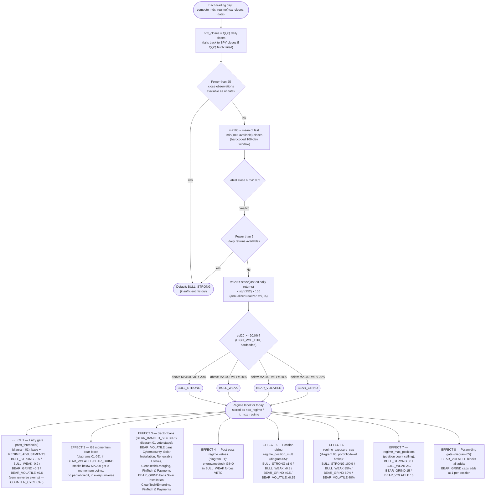

# 06 — Regime Detection and Downstream Effects

The strategy classifies the market into one of four regimes every trading
day using `compute_ndx_regime()` in `engine/portfolio_simulator.py`, based
on QQQ (falls back to SPY if QQQ price data is unavailable) versus its
100-day moving average and its 20-day realized volatility. That single
label — recomputed fresh each day — then fans out to influence gate
thresholds, sector bans, and position sizing everywhere else in the
system.

**Discrepancy found while building this diagram:** `config/strategy_params.json`
contains a `regime_detection` block (`ndx_ma_period: 100`,
`bear_volatile_threshold: -0.25`, `bear_grind_threshold: -0.15`,
`bull_weak_threshold: -0.05`) that looks like it should parameterize this
classifier. **It is dead configuration** — a repo-wide grep for
`regime_detection`, `bear_volatile_threshold`, `bear_grind_threshold`,
`bull_weak_threshold`, and `ndx_ma_period` outside `strategy_params.json`
returns zero hits. `compute_ndx_regime()` hardcodes its own logic (100-day
window is hardcoded via `min(100, len(avail))`, and the split is
"above/below 100-day MA" x "20-day annualized vol >= 20.0", not the
percentage-decline thresholds the JSON implies). The optimizer could
"tune" these four JSON values indefinitely with zero effect on simulated
behavior.

