# 07 — Full Trade Lifecycle (Big Picture)

This is the end-to-end summary: one trading day, one ticker, from universe
scan to a closed trade in the report. Each box maps to a dedicated diagram
with the exact per-sector numbers and branch logic — this page only shows
how the pieces connect. Source: `engine/portfolio_simulator.py
run_simulation()` (the day loop) orchestrating `engine/tester.py` (gates)
and its own `check_exits()` / buy loop.

```mermaid
flowchart TD
    DAY(["Trading day begins"]) --> REGIME["Compute today's market regime\nfrom QQQ vs MA100 + 20d vol\n-> see 06_regime_detection.md"]

    REGIME --> MARK["Mark open positions to today's close"]
    MARK --> EXITCHECK["Run check_exits() on every open position:\nDELISTED -> MA100_BREAKDOWN -> TRAIL_STOP ->\nTAKE_PROFIT -> (min-hold gate) -> MA50_CROSS ->\nBELOW_MA_DECLINING -> GM_EROSION_VETO -> MAX_HOLD\n-> see 04_exit_strategy.md"]
    EXITCHECK --> CLOSED["Positions that triggered an exit:\nsell shares, deduct commission,\nrecord closed trade (pnl_pct, pnl_dollars,\nexit_reason, gate_margins) to closed_trades[]"]

    CLOSED --> SCAN["score_universe(): scan every ticker\nin the SECTORS ticker lists"]
    SCAN --> ROUTE["Route each ticker to universe/sub-sector\nvia its Sector label (SECTOR_MAP)\n-> see 01_entry_gates_overview.md"]
    ROUTE --> VETO["Veto checks: GM erosion kill-switch,\nsector-specific vetoes, momentum-decay veto,\nBEAR_BANNED_SECTORS regime ban\n-> see 01_entry_gates_overview.md"]
    VETO -->|Vetoed| DROP1(["Dropped — not a candidate today"])
    VETO -->|Clear| GATES["Score G1-G8 for this universe/sub\n(G2 may use the gm_relative\nindustry-percentile path)\n-> see 02_entry_gate_detail_per_universe.md\n-> see 03_gm_relative_gate.md"]

    GATES --> SCORE["Sum weighted score, apply momentum rescue,\nnon-G8-failure penalty, min-direct-gates floor,\ntech-only late blocks\n-> see 01_entry_gates_overview.md"]
    SCORE --> THRESH{"score >= pass_threshold(universe)\n+ regime_adjustment?"}
    THRESH -->|No| DROP2(["Not a BUY candidate today"])
    THRESH -->|Yes| POSTVETO{"Universe-specific\npost-pass veto?"}
    POSTVETO -->|Yes| DROP1
    POSTVETO -->|No| CONF["Assign confidence: HIGH / MED / LOW\n(compute_confidence, based on score margin\nabove threshold and proxy-gate count)"]

    CONF --> RANK["All passing candidates ranked\nby score, descending"]
    RANK --> BUYLOOP["Buy loop: while cash > $2,500\nand positions < regime_max_positions\nand exposure < regime_exposure_cap"]
    BUYLOOP --> HELD{"Already holding\nthis ticker?"}
    HELD -->|Yes| PYRAMID["Pyramiding rules (regime-gated,\nmax 2 adds, min +10% gain)\n-> see 05_position_sizing.md"]
    HELD -->|No| SIZE["Size the buy: per_buy_fraction x\nconviction_mult x regime_position_mult,\ncapped by max_position_pct_equity,\nexposure headroom, and available cash\n-> see 05_position_sizing.md"]

    PYRAMID -->|Approved| SIZE
    PYRAMID -->|Blocked| SKIP(["Skip this candidate,\ntry next in ranked list"])

    SIZE --> FILL["Position opened or added to:\nshares, avg_cost, peak_price,\nconfidence, score, threshold recorded"]
    FILL --> NEXTCAND{"More candidates and\ncash/exposure headroom\nremain?"}
    NEXTCAND -->|Yes| BUYLOOP
    NEXTCAND -->|No| EQUITY["Record end-of-day equity curve:\nequity, cash, n_positions, exposure, regime"]

    EQUITY --> NEXTDAY{"More trading\ndays remain?"}
    NEXTDAY -->|Yes| DAY
    NEXTDAY -->|No| REPORT["Simulation ends: closed_trades +\nopen positions + equity_curve ->\ncompute_metrics() -> portfolio_report.json /\n.xlsx (fitness, drawdown, per-regime stats)"]

    REPORT --> OPT["Fed into the optimizer loop, which tunes\nconfig/strategy_params.json based on\nclosed-trade outcomes\n-> see 08_optimizer_loop.md"]
```

