# 08 — Optimizer Loop (Meta-System)

`optimizers/trade_optimizer.py` is a separate, higher-level agent loop
that tunes `config/strategy_params.json` by repeatedly running the
simulator and keeping only changes that measurably help — it is not part
of the strategy itself, but the mechanism that adjusts every threshold
shown in diagrams 01–06 over time. It uses three LLM roles per iteration
(Agent 1 = Haiku trade analyst, Agent 2 = Opus parameter optimizer, Agent 3
= Haiku historian, run once per session) plus deterministic code-level
guardrails, a repeat-blocker, and a periodic walk-forward robustness
check. Current live constants: fitness = `total_return_pct x 0.5 +
(sharpe x 20) x 0.5`; guardrails `DRAWDOWN_CEILING = -45.0%`,
`STAY_INVESTED_MIN = 60%` of baseline closed trades,
`CASH_IDLE_MAX = 40%` average cash; walk-forward runs every
`WALK_FORWARD_CHECK_EVERY = 3` kept changes with a per-period floor margin
of 3.0 fitness points below baseline.

```mermaid
flowchart TD
    SESSTART(["Session start (trade_optimizer.py main)"]) --> RESTORE["Restore strategy_params.json from\ncurrent_best_params.json\n(the validated ground truth —\nstrategy_params.json is only a scratchpad)"]
    RESTORE --> BASELINE["Run baseline simulation on restored params\n-> base_fitness, baseline_n_closed"]
    BASELINE --> HIST["Agent 3 (Historian, Haiku) — runs ONCE per session:\nreads full params_history.json,\nproduces unexplored_parameters, family_status,\nbest_fitness_ever, direction_exhausted flags"]
    HIST --> BLOCKLIST["Build code-level repeat-blocker set:\nall (param_path, value) pairs previously\nREVERTED in history"]

    BLOCKLIST --> ITERSTART(["Iteration N begins\n(budget_remaining = budget_limit - session_cost)"])
    ITERSTART --> BUDGETCHK{"budget_remaining <= 0?"}
    BUDGETCHK -->|Yes| SESSEND
    BUDGETCHK -->|No| PREP["run_prep(): refresh sampled_trades.json\n(30 sampled trades from portfolio_report.json,\nor fewer for OOS reports)"]

    PREP --> A1["Agent 1 (Trade Analyst, Haiku):\nreads 30 trade narratives ->\nJSON verdicts: entry_signals, exit_signals,\ntop_signal, timing_signals per trade"]
    A1 --> A1CHK{"Agent 1 returned\nvalid output?"}
    A1CHK -->|No| SKIPITER(["Skip iteration, no change"])
    A1CHK -->|Yes| A2["Agent 2 (Parameter Optimizer, Opus):\nreads Agent 1 signals + Historian summary +\nsession blacklist + live strategy_params.json ->\nproposes ONE dot-path param change + rationale"]

    A2 --> A2CHK{"Agent 2 proposal\nvalid (schema-checked)?"}
    A2CHK -->|No| SKIPITER
    A2CHK -->|Yes| REPEAT{"(param_path, value) already\nin all-time reverted history?"}
    REPEAT -->|Yes| REPROMPT["Re-prompt Agent 2 once with\nrejection message naming the\nblocked pair + unexplored families"]
    REPROMPT --> REPEAT2{"2nd proposal\nalso a repeat?"}
    REPEAT2 -->|Yes| SKIPITER
    REPEAT2 -->|No| APPLY
    REPEAT -->|No| APPLY["apply_param_change(): write new value\ninto strategy_params.json at that JSON path"]

    APPLY --> APPLYCHK{"Write succeeded?"}
    APPLYCHK -->|No| REVERT1["restore_to_best(), log APPLY_FAILED"]
    APPLYCHK -->|Yes| SIM["Run portfolio_simulator.py as a subprocess\n(full backtest with new param)"]

    SIM --> SIMCHK{"Simulator exited 0?"}
    SIMCHK -->|No| REVERT2["restore_to_best(), log SIM_ERROR"]
    SIMCHK -->|Yes| FITNESS["Read portfolio_report.json ->\ncompute new_fitness"]

    FITNESS --> GUARD{"check_guardrails():\nn_closed>0 & return not NaN,\nmax_drawdown >= -45%,\nn_closed >= 60% of baseline,\navg_cash_pct <= 40%?"}
    GUARD -->|Fail| REVERT3["restore_to_best(), log REVERTED (guardrail)"]
    GUARD -->|Pass| IMPROVE{"new_fitness >\ncurrent_fitness?"}

    IMPROVE -->|No| REVERT4["restore_to_best(), log ROLLBACK\n(no_improvement)"]
    IMPROVE -->|Yes| KEPTCOUNT["kept_total += 1"]

    KEPTCOUNT --> WFDUE{"kept_total % 3 == 0?\n(WALK_FORWARD_CHECK_EVERY)"}
    WFDUE -->|No| SAVEBEST
    WFDUE -->|Yes| WFRUN["Run all 4 walk-forward periods\nwith current strategy_params.json"]
    WFRUN --> WFGATE{"check_wf_floors():\n(b) every period fitness >=\nits baseline - 3.0 points\n(c) average WF fitness >= baseline average?"}
    WFGATE -->|Fail| REVERT5["restore_to_best(), log\nREVERTED_WF_FLOOR_FAIL\n(kept_total NOT incremented\nfor this change)"]
    WFGATE -->|Pass| WFSAVE["save_wf_baselines(): raise the\nper-regime floor references\nto this new higher state"]

    WFSAVE --> SAVEBEST["save_current_best(): snapshot\nstrategy_params.json -> current_best_params.json\n(only ever moves up, never on reverts)"]
    SAVEBEST --> LOGHIST["append_params_history(): record\nkept=True, param_path, old/new value,\nfitness before/after, rationale,\nwalk-forward result if run"]

    REVERT1 & REVERT2 & REVERT3 & REVERT4 & REVERT5 --> LOGHISTREV["append_params_history():\nrecord kept=False + reason"]

    LOGHIST & LOGHISTREV --> ITEREND{"More iterations\nremain in budget?"}
    ITEREND -->|Yes| ITERSTART
    ITEREND -->|No| SESSEND(["SESSION COMPLETE:\nprint iterations run, changes kept/reverted,\nsession fitness delta, best-ever fitness,\nsession API cost"])
```

